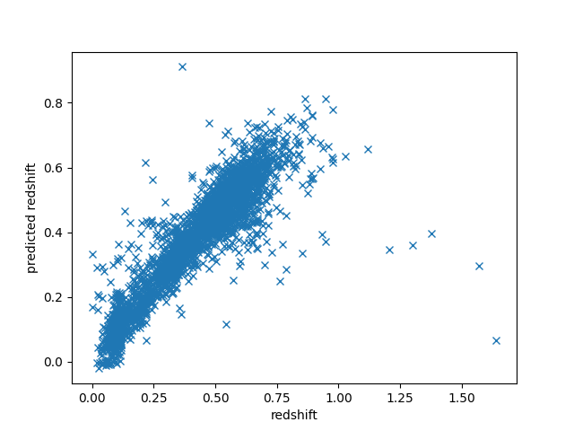
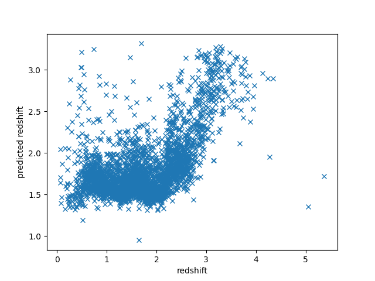
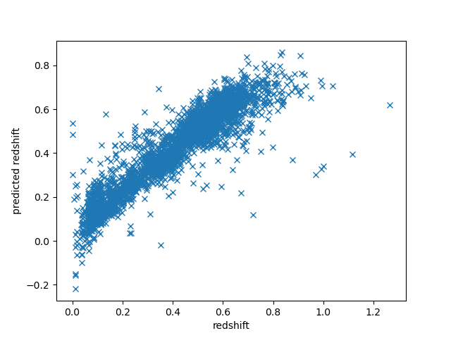
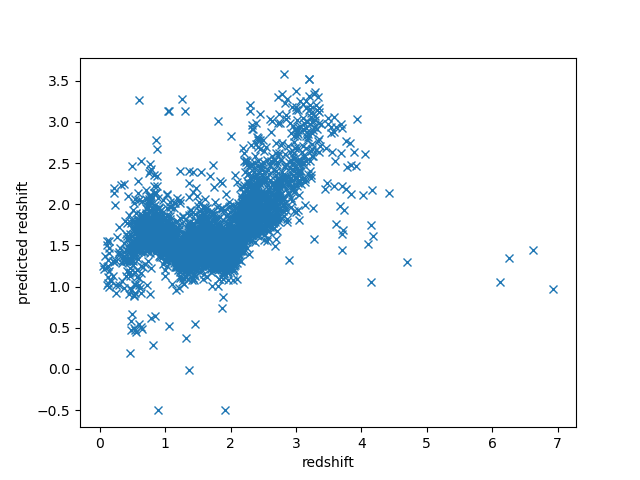

# Astonomische Methoden (astronomical methods)

This project was created as part of the lecture 'Astronomische Methoden'.
The aim is to develop a simple neural network which predicts the redshift from the given bands.

The data were accessed using `astroquery.sdss`.

## Network
While the network shows for the galaxies at least a tendency do quasars perform pretty bad.
Since the amount of data for larger redshifts is smaller, the network trains these less. 
This results in a worse prediction for large redshifts.

|   | Galaxies | Quasars |
|---|----------|---------|
|Default| || 
|Modified| || 

## Data
The data used is from the Sloan Digital Sky Survey (SDSS) DR16. To obtain randomly sampled redshifts the data
is sorted by right ascension before choosing the amount of data sets to download from the top of the list. 
The object class is resticted depending for which network the training data is used for. 
